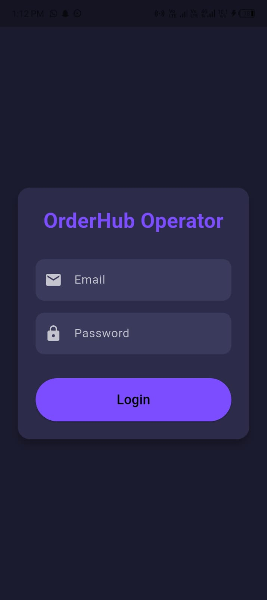
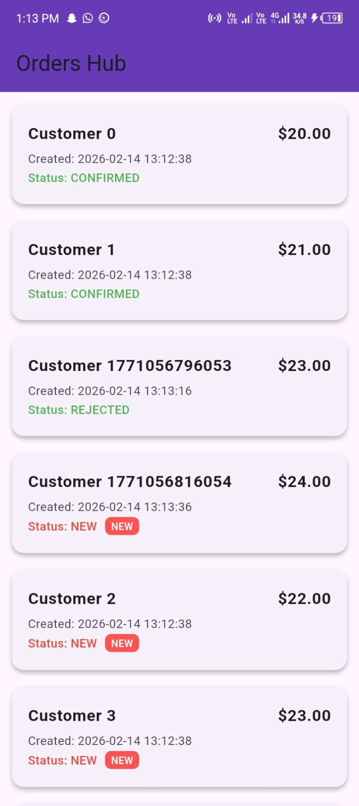
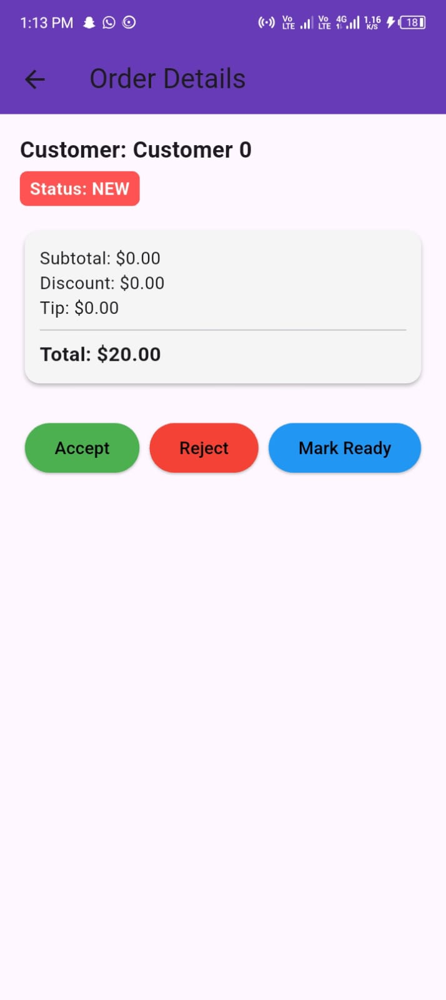
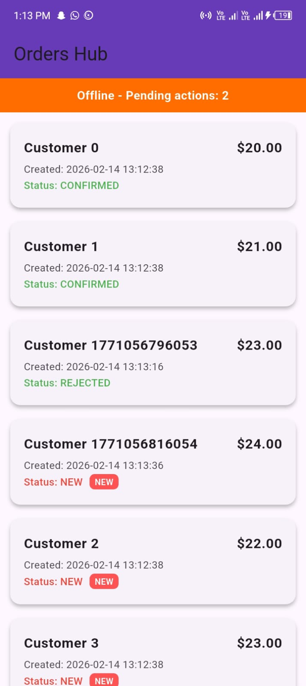
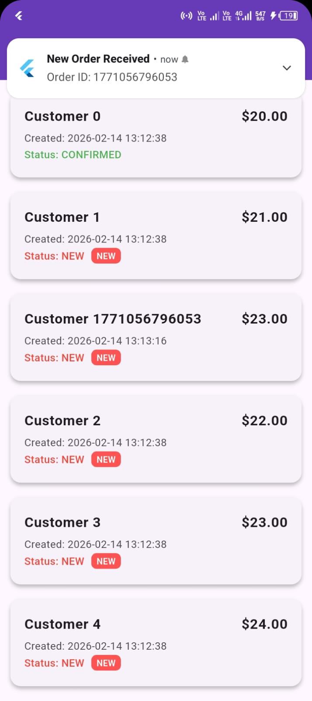

# OrderHub Operator - Flutter App

A realistic mobile app for restaurant operators to receive and manage incoming orders.  
Built with **Flutter**, **Riverpod**, and **Hive** (offline-first, clean architecture).

## Features

- **Authentication**
  - Mocked login screen
  - Securely stores access token (Hive)
  - Handles expired/invalid token (redirects to login)
- **Orders List**
  - Shows orders with order_id, customer name, total, created_at, status
  - "NEW" badge for new orders
  - Pull-to-refresh
  - Loading / empty / error states
  - Auto-refresh / polling every 20 seconds
- **Order Details + Actions**
  - View items, modifiers, subtotal, discount, tip, total, notes
  - Actions: Accept → CONFIRMED, Reject → REJECTED (with reason), Mark Ready → READY
  - Prevents duplicate taps
- **Offline-first**
  - Orders cached locally (Hive)
  - Actions queued while offline
  - Shows banner: `Offline - Pending actions: N`
  - Queued actions automatically synced when back online
- **New Order Simulation**
  - Auto-generates new orders every 20 seconds
  - Appears in the list with "NEW" badge

## Screenshots

### Login Screen

### Orders List

### Order Details

### Offline Mode

### New Order

## How to Run

1. Clone or unzip project folder.
2. Open in **VS Code** or **Android Studio**.
3. Run:
       flutter pub get
       flutter run

Simulate Offline Mode

Enable Airplane Mode or disconnect internet.

Accept / Reject / Mark Ready → "Offline - Pending actions: N" banner appears.

Reconnect → actions automatically sync, banner disappears.

Sample API Payloads (Mocked)

Login Request

POST /login
{
  "email": "test@test.com",
  "password": "123456"
}

Login Response

{
  "access_token": "mocked_access_token_123",
  "expires_in": 3600
}

Fetch Orders Response

[
  {
    "id": "101",
    "customerName": "John Doe",
    "status": "NEW",
    "createdAt": "2026-02-13T12:00:00",
    "total": 25.0,
    "items": [{"name": "Burger", "quantity": 1}],
    "modifiers": [{"name": "Extra Cheese"}],
    "subtotal": 25.0,
    "discount": 0.0,
    "tip": 2.0,
    "notes": "Leave at door"
  }
]

Update Status Request

POST /orders/101/status
{
  "status": "CONFIRMED"
}

Update Status Response

{
  "id": "101",
  "status": "CONFIRMED"
}

Caching & Queued Actions

Orders cached locally using Hive.

Offline actions queued in Hive.

When back online, queued actions sync automatically.

Duplicate actions handled gracefully (idempotent UI).

Architecture Summary

Feature-based / Clean architecture

UI Layer: Screens + Widgets

Controller Layer: Riverpod StateNotifier (OrdersController, AuthController)

Data Layer: Repository + Hive local storage

Domain Layer: Models (Order, User) + mappers

State Management: Riverpod

Offline-first: Hive for caching + queued actions

Polling: Timer every 20 seconds for new orders

Next Improvements:

Add unit tests for controller and repository

Add analytics/logging hooks

Polish design system and themes

Demo Flow:

Launch app → Login

Orders List + refresh

Tap any order → Order Details

Accept / Reject / Mark Ready

Offline mode → Pending actions banner

Back online → queued actions sync

Observe new orders appear every 20 seconds
